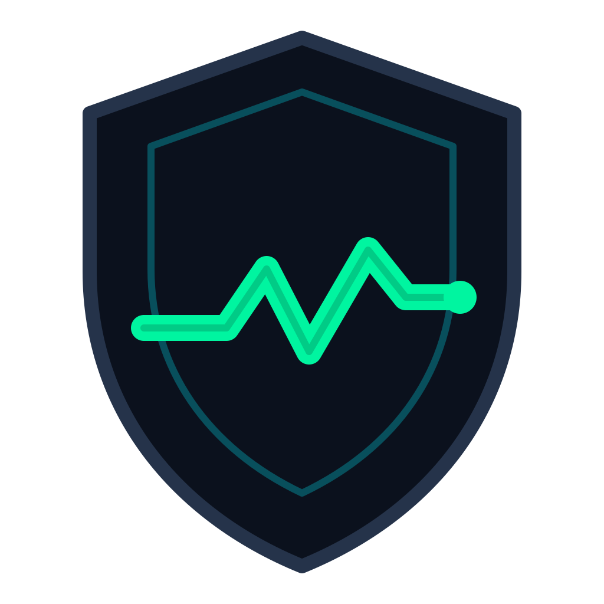

<p align="center">
  
</p>

<h1 align="center">Sentinel Protocol</h1>

<p align="center">
  <strong>High-Assurance On-Chain Price Safety & Circuit Breaker for Tokenized Equities on Solana</strong>
</p>

<p align="center">
  <a href="https://explorer.solana.com/address/DfKAoENAneWyLgwt5BKP7PfigPG8Phfv3nywLZnhfCrW?cluster=devnet"></a>
  <a href="https://github.com/rehna-jp/sentinel"></a>
  <a href="https://pyth.network"></a>
  <a href="https://prestocks.com"></a>
  <a href="LICENSE"></a>
</p>

---

## 1. Executive Summary

Tokenized equities (`AAPLX`, `TSLAX`, etc.) trade **24/7 on Solana**, while underlying equity markets operate strictly on traditional exchange schedules (9:30 AM – 4:00 PM ET, Monday–Friday).

This structural mismatch introduces severe systemic vulnerabilities into Solana DeFi:
* **Off-Market Staleness:** Over weekends and holidays, reference equity feeds cease updating for 48+ hours. Protocols consuming these oracles risk settling liquidations or perp funding against frozen prices.
* **Unobserved Price Drift (Depeg):** In thin overnight markets, on-chain token prices frequently diverge from real-world equity valuations due to liquidity vacuums or speculative runs.
* **Cascading Liquidations:** Without on-chain gating, lending platforms and automated liquidators execute forced sales based on outdated or divergent reference prices, destroying user collateral unfairly.

**Sentinel** is an autonomous on-chain verification primitive. It acts as an atomic circuit breaker that any Solana protocol can invoke before touching prices, guaranteeing that transactions only execute when feeds are verifiably fresh and aligned.

---

## 2. System Architecture

```text
 ┌─────────────────────────────────────────────────────────┐
 │               Caller Protocol (DEX / Lending)           │
 └────────────────────────────┬────────────────────────────┘
                              │
                    1. Atomic CPI Call
               sentinel::cpi::check_price_safety()
                              │
                              ▼
 ┌─────────────────────────────────────────────────────────┐
 │                    SENTINEL CHECKER                     │
 │      (Program: DfKAoENAneWyLgwt5BKP7PfigPG8Phfv3nywLZnhfCrW)  │
 ├─────────────────────────────────────────────────────────┤
 │ 1. Read Pyth Equity Feed Account (Equity.US.AAPL/USD)   │
 │ 2. Read Pyth xStock Feed Account (Crypto.AAPLX/USD)     │
 │ 3. Fetch Solana Runtime Clock Sysvar                    │
 ├─────────────────────────────────────────────────────────┤
 │               ON-CHAIN INVARIANT EVALUATION             │
 │                                                         │
 │  [Freshness Check]                                      │
 │   max(now - t_equity, now - t_xstock) > max_staleness?  │
 │     └─► YES: Return PriceSafetyResult::Stale            │
 │                                                         │
 │  [Normalization & Drift Calculation]                    │
 │   Convert Pyth exponents to 10^-6 integer fixed-point   │
 │   diff_bps = |P_equity - P_xstock| / P_equity * 10,000  │
 │   diff_bps > max_deviation_bps?                         │
 │     └─► YES: Return PriceSafetyResult::Divergent        │
 │                                                         │
 │     └─► NO:  Return PriceSafetyResult::Safe             │
 └────────────────────────────┬────────────────────────────┘
                              │
                     2. Typed Safety Result
                              │
                              ▼
 ┌─────────────────────────────────────────────────────────┐
 │                 Caller Execution Gate                   │
 │   require!(safety == PriceSafetyResult::Safe, Error);   │
 └─────────────────────────────────────────────────────────┘
```

---

## 3. Protocol Integration (One-Line Rust CPI)

Integrating Sentinel into any Solana protocol requires zero custom oracle parsing. Call Sentinel via Cross-Program Invocation (CPI) before executing a trade, borrow, or liquidation:

```rust
use sentinel::cpi::accounts::CheckPriceSafety;
use sentinel::state::PriceSafetyResult;

// 1. Invoke Sentinel verification gate via CPI:
let cpi_ctx = CpiContext::new(
    ctx.accounts.sentinel_program.key(),
    CheckPriceSafety {
        config: ctx.accounts.sentinel_config.to_account_info(),
        equity_price_update: ctx.accounts.equity_price.to_account_info(),
        xstock_price_update: ctx.accounts.xstock_price.to_account_info(),
        clock: ctx.accounts.clock.to_account_info(),
    },
);

let safety_verdict = sentinel::cpi::check_price_safety(cpi_ctx)?.get();

// 2. Reject unsafe prices before state mutations:
require!(
    safety_verdict == PriceSafetyResult::Safe,
    ErrorCode::UnsafePriceCondition
);
```

---

## 4. Mathematical Invariants & State Machine

Sentinel enforces deterministic price safety through three verified states:

### State 1: `Safe`
$$\max(\Delta t_{	ext{equity}}, \Delta t_{	ext{xstock}}) \le T_{	ext{max}} \quad \land \quad 	ext{Spread}_{	ext{bps}} \le 	ext{Threshold}_{	ext{bps}}$$
* Both oracle feeds have updated within the configured threshold ($T_{	ext{max}} = 300	ext{s}$).
* Spread between the real-world equity feed and the on-chain tokenized pool is within tolerance ($\le 200	ext{ bps} = 2.00\%$).
* **Outcome:** Execution allowed.

### State 2: `Stale { seconds_stale }`
$$\Delta t_{	ext{equity}} > T_{	ext{max}} \quad \lor \quad \Delta t_{	ext{xstock}} > T_{	ext{max}}$$
* One or both feeds have ceased publishing (e.g., market close at Friday 4:00 PM ET).
* **Outcome:** Reverts atomically with `ConsumerError::PriceStale` (Error 6001). Emits log: `"Sentinel: BLOCKED — price stale by {m}m {s}s"`.

### State 3: `Divergent { actual_bps, limit_bps }`
$$	ext{Spread}_{	ext{bps}} = rac{|P_{	ext{equity}} - P_{	ext{xstock}}|}{P_{	ext{equity}}} 	imes 10,000 > 	ext{Threshold}_{	ext{bps}}$$
* Prices have uncoupled due to liquidity fragmentation or flash shocks.
* **Outcome:** Reverts atomically with `ConsumerError::PriceDivergent` (Error 6002). Emits log: `"Sentinel: BLOCKED — spread {actual_bps}bps exceeds limit {limit_bps}bps"`.

---

## 5. Integer-Safe Price Normalization

Pyth feeds supply prices as an `(i64, i32)` tuple representing `price * 10^exponent`. Different feeds frequently report differing exponents (e.g., $-8$ for high-precision equities vs $-5$ for tokenized assets).

Because floating-point arithmetic (`f64`) is non-deterministic and forbidden in high-assurance Solana BPF contracts, Sentinel normalizes all prices into integer cents scaled uniformly to $10^{-6}$:

```rust
fn normalize_price(price: i64, exponent: i32) -> Result<u64> {
    let target_exp: i32 = -6;
    let shift = exponent - target_exp;
    require!(price >= 0, SentinelError::InvalidPrice);
    let price_u64 = price as u64;

    if shift >= 0 {
        let multiplier = 10u64.checked_pow(shift as u32).ok_or(SentinelError::InvalidExponent)?;
        price_u64.checked_mul(multiplier).ok_or(SentinelError::ArithmeticOverflow.into())
    } else {
        let divisor = 10u64.checked_pow((-shift) as u32).ok_or(SentinelError::InvalidExponent)?;
        Ok(price_u64 / divisor)
    }
}
```

---

## 6. Live Solana Devnet Deployments

| Program Name | Program ID | Deployment Details | Explorer |
|---|---|---|---|
| **Sentinel Checker** | `DfKAoENAneWyLgwt5BKP7PfigPG8Phfv3nywLZnhfCrW` | On-chain safety engine & circuit breaker | [Solscan](https://solscan.io/account/DfKAoENAneWyLgwt5BKP7PfigPG8Phfv3nywLZnhfCrW?cluster=devnet) / [Solana Explorer](https://explorer.solana.com/address/DfKAoENAneWyLgwt5BKP7PfigPG8Phfv3nywLZnhfCrW?cluster=devnet) |
| **Consumer Demo** | `9kLnfpk3dD2hqdG987oac7UXK1j67yLC41s45ebbujj9` | Lending protocol gated via Sentinel CPI | [Solscan](https://solscan.io/account/9kLnfpk3dD2hqdG987oac7UXK1j67yLC41s45ebbujj9?cluster=devnet) / [Solana Explorer](https://explorer.solana.com/address/9kLnfpk3dD2hqdG987oac7UXK1j67yLC41s45ebbujj9?cluster=devnet) |

* **Upgrade Authority:** `296KKHsmDSA2ENiJ4YdDZ62Hrw5JePKYBtfV3MSsSGnW`
* **Equity Feed ID:** `Equity.US.AAPL/USD`
* **xStock Feed ID:** `Crypto.AAPLX/USD`

---

## 7. Formal Verification via LiteSVM

Sentinel features full-fidelity integration testing using **LiteSVM** (the in-process Solana Virtual Machine runner), compiling actual SBF binaries and simulating CPI execution without external RPC network dependencies.

```bash
cargo test --workspace
```

### Execution Log:
```text
running 3 tests
test test_consumer_stale_blocked ... ok
test test_consumer_safe_liquidation ... ok
test test_consumer_divergent_blocked ... ok
test result: ok. 3 passed; 0 failed; 0 ignored; finished in 0.09s

running 3 tests
test test_stale_state ... ok
test test_divergent_state ... ok
test test_safe_state ... ok
test result: ok. 3 passed; 0 failed; 0 ignored; finished in 0.07s

running 1 test
test test_initialize ... ok
test result: ok. 1 passed; 0 failed; 0 ignored; finished in 0.06s
```

All **7 test cases pass deterministically in under 0.25 seconds**.

---

## 8. Frontend Interface & Simulation Terminal

Sentinel provides a real-time monitoring console that displays the full price discovery chain:
1. **Pre-IPO Private Market Tier:** Live valuations ingested directly from the [PreStocks Public API](https://prestocks.com/api/prestocks) (Anduril, Anthropic, Figure AI).
2. **On-Chain Tokenized xStock Tier:** Real-time pricing via Pyth Crypto feeds.
3. **Traditional Equity Benchmark:** Reference pricing via Pyth US Equity feeds.
4. **Interactive Simulation Terminal:** Allows protocol engineers to simulate market close conditions, depeg events, and verify atomic CPI reverts.

To run the console locally:
```bash
python3 -m http.server 3300 --directory app
```
Navigate to `http://localhost:3300`.

---

## 9. Ecosystem Integrations

* **Pyth Network:** Serves as the primary trust root for both high-frequency on-chain token feeds and real-world equities via `pyth-solana-receiver-sdk` and `PriceUpdateV2` account structures.
* **PreStocks:** Supplies pre-IPO benchmark valuations, extending the on-chain discovery matrix to late-stage private companies.
* **Solana DeFi Ecosystem:** Designed for modular composability across DEXs (order-fill validation), Lending Protocols (liquidation safety gates), and Perpetuals Exchanges (mark price drift boundaries).

---

## License
MIT License. Open-source infrastructure for the Solana ecosystem.
